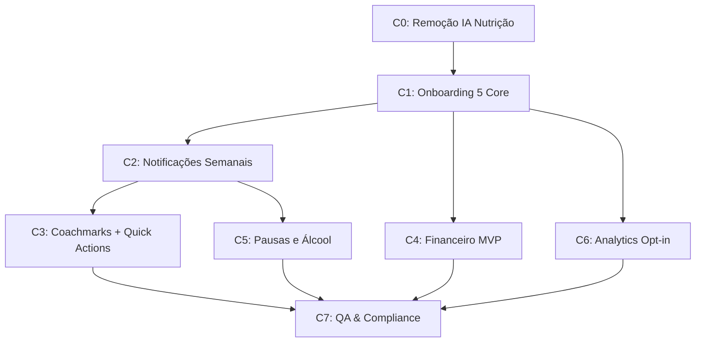

# Planejamento de Refatoração - Pinpoint GLP-1

**Data:** 2025-11-12
**Branch Base:** `claude/planeje-es-011CV4C8NWiX3LEFu6yWTZRQ`
**Status:** Em Planejamento

---

## Índice

1. [Guardrails e Convenções](#guardrails-e-convenções)
2. [Visão Geral das Fases](#visão-geral-das-fases)
3. [C0 - Remoção da IA de Nutrição](#c0---remoção-da-ia-de-nutrição-p0)
4. [C1 - Onboarding Core](#c1---onboarding-core-5-telas--hooks-p1)
5. [C2 - Notificações Semanais](#c2---notificações-semanais-p1)
6. [C3 - Coachmarks + Quick Actions](#c3---coachmarks--quick-actions-p1)
7. [C4 - Financeiro MVP](#c4---financeiro-mvp-p1)
8. [C5 - Pausas e Álcool](#c5---pausas-e-álcool-p1)
9. [C6 - Analytics Opt-in](#c6---analytics-opt-in-p1)
10. [C7 - QA & Compliance](#c7---qa--compliance-p0p1)
11. [Ordem de Execução](#ordem-de-execução-sugerida)
12. [Riscos e Mitigações](#riscos-e-mitigações)

---

## Guardrails e Convenções

### Stack Técnica
- **Framework:** Expo SDK 54 + React Native 0.81.5
- **Linguagem:** TypeScript 5.9 (strict mode)
- **Roteamento:** Expo Router 6.0 (file-based)
- **Plataformas:** iOS + Android
- **Idioma:** PT-BR
- **Formato de horário:** 24h
- **Moeda:** BRL (R$)

### Acessibilidade
- **Contraste mínimo:** 4.5:1 (AA)
- **Áreas de toque:** ≥ 44×44 pixels
- **SafeArea:** Sempre usar `SafeAreaView` ou `useSafeAreaInsets`
- **Dark Mode:** Respeitar preferências do sistema
- **Ícones:** `phosphor-react-native` (sem emojis no código, apenas na UI quando apropriado)

### Analytics & Privacidade
- **Analytics:** Opt-in obrigatório antes de rastrear
- **LGPD:** Disclaimer visível + consentimento explícito
- **Dados sensíveis:** Nunca em eventos de analytics sem consentimento

### Desenvolvimento
- **Branches:** Feature branches por ciclo (`cleanup/*`, `feature/*`, `refactor/*`, `release/*`)
- **PRs:** Pequenos, focados, com checklist de QA
- **Testes:** Validação manual iOS/Android para cada PR
- **Linters:** ESLint + Prettier devem passar antes do merge

---

## Visão Geral das Fases

| Fase | Prioridade | Esforço | Dependências | Branch |
|------|-----------|---------|--------------|--------|
| C0 | P0 | 4h | Nenhuma | `cleanup/remove-nutrition-ai` |
| C1 | P1 | 16h | C0 | `refactor/onboarding-5-core` |
| C2 | P1 | 6h | C1 | `feature/weekly-reminders` |
| C3 | P1 | 8h | C1, C2 | `feature/coachmarks-home` |
| C4 | P1 | 20h | C1 | `feature/finance-mvp` |
| C5 | P1 | 12h | C1, C2 | `feature/pauses-alcohol` |
| C6 | P1 | 6h | C1 | `feature/analytics-optin` |
| C7 | P0/P1 | 8h | Todos | `release/qa-compliance` |

**Total estimado:** ~80h (2 semanas full-time ou 4 semanas part-time)

---

## C0 - Remoção da IA de Nutrição (P0)

### Objetivo
Remover completamente a feature de IA de nutrição (Gemini) do app, incluindo arquivos, dependências, rotas e dados.

### Branch
`cleanup/remove-nutrition-ai` (a partir de `claude/planeje-es-011CV4C8NWiX3LEFu6yWTZRQ`)

### Análise do Estado Atual

**Arquivos identificados para remoção:**
```
lib/gemini.ts                                    (118 linhas)
hooks/useGeminiChat.ts                           (89 linhas)
hooks/useNutrition.ts                            (130 linhas)
components/nutrition/NutritionCard.tsx
components/nutrition/ConfirmationModal.tsx
components/nutrition/AudioRecorder.tsx
components/nutrition/ChatMessage.tsx
components/nutrition/InstructionsCard.tsx
app/(tabs)/add-nutrition.tsx
```

**Referências em outros arquivos:**
- `app/(tabs)/_layout.tsx`: Aba "AI" (sparkle icon) + rota `/add-nutrition`
- `app/(tabs)/calendar.tsx`: Possíveis referências a nutrition events
- `components/dashboard/TodaySection.tsx`: Pode exibir dados de nutrição
- `lib/auth.ts`: Script de deleção de dados pode referenciar `daily_nutrition`
- `lib/types.ts`: Tipos relacionados a nutrição
- `lib/analytics.ts`: Eventos `nutrition_*` (se existirem)

**Dependências:**
- `@google/generative-ai`: ^0.24.1 (package.json linha 21)
- Variável de ambiente: `EXPO_PUBLIC_GEMINI_API_KEY`

**Banco de dados:**
- Tabela: `daily_nutrition` (migration 008_daily_nutrition.sql)

### Tarefas Detalhadas

#### 1. Análise de Impacto (1h)
- [ ] Executar grep completo para encontrar todas as referências
  ```bash
  grep -r "nutrition\|Nutrition\|NUTRITION\|gemini\|Gemini\|GEMINI" --exclude-dir=node_modules
  ```
- [ ] Mapear todas as dependências entre componentes
- [ ] Verificar se há feature flags relacionadas

#### 2. Remoção de Arquivos (1h)
- [ ] Deletar `lib/gemini.ts`
- [ ] Deletar `hooks/useGeminiChat.ts`
- [ ] Deletar `hooks/useNutrition.ts`
- [ ] Deletar `components/nutrition/` (diretório completo)
- [ ] Deletar `app/(tabs)/add-nutrition.tsx`

#### 3. Atualização de Rotas e Navegação (30min)
- [ ] Editar `app/(tabs)/_layout.tsx`:
  - Remover aba "AI" (sparkle icon)
  - Remover import de `add-nutrition`
  - Ajustar índices das abas restantes

#### 4. Limpeza de Imports e Referências (1h)
- [ ] Editar `app/(tabs)/calendar.tsx` (remover referências a nutrition)
- [ ] Editar `components/dashboard/TodaySection.tsx` (remover nutrition card)
- [ ] Editar `lib/types.ts` (remover tipos relacionados)
- [ ] Editar `lib/analytics.ts` (remover eventos `nutrition_*`)
- [ ] Editar `lib/auth.ts` (remover referências em scripts de deleção)

#### 5. Remoção de Dependências (15min)
- [ ] Editar `package.json`: remover `@google/generative-ai`
- [ ] Executar `npm install` para atualizar `package-lock.json`
- [ ] Editar `.env.example`: remover linha `EXPO_PUBLIC_GEMINI_API_KEY=`
- [ ] Atualizar README.md (remover seção de API Key do Gemini)

#### 6. Limpeza de Banco de Dados (30min)
- [ ] Criar migration para dropar tabela `daily_nutrition`:
  ```sql
  -- supabase/migrations/XXX_drop_daily_nutrition.sql
  drop table if exists daily_nutrition cascade;
  ```
- [ ] Executar migration em development
- [ ] Documentar migração para produção (se aplicável)

#### 7. Validação (30min)
- [ ] Executar `npm run type-check` (zero erros)
- [ ] Executar `npm run lint` (zero erros)
- [ ] Build iOS: `npx expo run:ios` (sucesso)
- [ ] Build Android: `npx expo run:android` (sucesso)
- [ ] Testar navegação entre abas (sem crashes)
- [ ] Verificar se não há referências quebradas

### Definition of Done
- ✅ Nenhum arquivo relacionado a nutrição/gemini existe no projeto
- ✅ Nenhuma referência a nutrição em imports ou código
- ✅ Dependência `@google/generative-ai` removida
- ✅ Variável `EXPO_PUBLIC_GEMINI_API_KEY` removida
- ✅ Aba de IA removida da navegação
- ✅ App compila sem erros em iOS e Android
- ✅ Linters (TypeScript + ESLint) passam
- ✅ README e .env.example atualizados
- ✅ PR criado com checklist de validação

### Riscos
- **Baixo:** Feature isolada, sem dependências críticas
- **Atenção:** Verificar se usuários existentes têm dados em `daily_nutrition` (considerar migração de dados se necessário)

---

## C1 - Onboarding Core (5 telas) + Hooks (P1)

### Objetivo
Refatorar o onboarding atual (23 telas) para um fluxo essencial de 5 telas core, com hooks opcionais entre passos que **não coletam dados** e **não alteram o progresso**.

### Branch
`refactor/onboarding-5-core` (a partir de `cleanup/remove-nutrition-ai`)

### Análise do Estado Atual

**Onboarding atual:**
- 23 telas implementadas em `components/onboarding/` (27 arquivos)
- Fluxo gerenciado por `app/(auth)/onboarding-flow.tsx` (618 linhas)
- Hook de persistência: `hooks/useOnboarding.ts` (310 linhas)
- Feature flags: `FF_ONBOARDING_23` (true), `FF_ONBOARDING_CORE8` (false)
- Progress tracking via AsyncStorage (`@mounjaro:onboarding_progress`)

**Problemas identificados:**
- Muito longo (23 passos, ~10-15 minutos)
- Inclui frequência "diária" (não aplicável a GLP-1)
- Doses não são condicionadas por medicamento
- Mistura coleta de dados com educação
- Não tem hooks entre passos (como custos, álcool, pausas)

### Novo Fluxo Proposto

#### 5 Telas Core

1. **Welcome** (`app/(onboarding)/Welcome.tsx`)
   - Boas-vindas e introdução ao app
   - Valor de proposta: "Acompanhe seu tratamento com Mounjaro/Retatrutida"
   - CTA: "Começar"

2. **Compliance** (`app/(onboarding)/Compliance.tsx`)
   - Disclaimer clínico (não substitui médico)
   - Consentimento LGPD (opt-in para analytics)
   - Checkbox obrigatório: "Li e aceito os termos"
   - Persistir: `consentVersion`, `consentAcceptedAt`, `analyticsOptIn`

3. **MedicationDose** (`app/(onboarding)/MedicationDose.tsx`)
   - **Passo 1:** Selecionar medicamento
     - Opções: Mounjaro, Retatrutida, Ozempic, Saxenda, Wegovy, Zepbound, Outro
     - Destacar: Mounjaro e Retatrutida (badges "Popular" ou "Novo")
   - **Passo 2:** Selecionar dose **condicionada ao medicamento**
     - Mounjaro: 2.5, 5, 7.5, 10, 12.5, 15 mg
     - Retatrutida: 2, 4, 6, 8, 10, 12 mg
     - Outros: doses específicas de cada medicamento
   - **Regra crítica:** Sem opção "diária" (apenas semanal para GLP-1)
   - Persistir: `medication`, `dosage`, `frequency: 'weekly'`

4. **Schedule** (`app/(onboarding)/Schedule.tsx`)
   - Perguntar: "Qual dia da semana você aplica?"
     - Seletor de dia (seg-dom)
   - Perguntar: "Que horas prefere ser lembrado?"
     - Time picker (formato 24h)
   - Mostrar preview: "Próxima aplicação: Sexta, 18:00"
   - Persistir: `preferredDay` (0-6), `preferredTime` (HH:mm)

5. **Permissions** (`app/(onboarding)/Permissions.tsx`)
   - Solicitar permissão de notificações (gracioso, não bloqueante)
   - Explicar benefícios: "Nunca esqueça sua dose semanal"
   - Botões: "Permitir Notificações" / "Pular"
   - Se permitir: agendar primeira notificação semanal

#### Hooks Entre Passos (Opcionais)

**Hook: FeatureHook** (`app/(onboarding)/FeatureHook.tsx`)
- **Quando:** Entre Schedule e Permissions
- **Propósito:** Apresentar features opcionais (Custos, Álcool, Pausas)
- **Comportamento:**
  - Cards informativos (não formulários)
  - Botão: "Ver Depois" (continua sem coletar dados)
  - Não altera o progresso do onboarding
  - Apenas informa que as features existem

### Estrutura de Arquivos

```
app/(onboarding)/
├── _layout.tsx                 # Layout do grupo onboarding
├── Welcome.tsx                 # Tela 1
├── Compliance.tsx              # Tela 2 (disclaimer + LGPD)
├── MedicationDose.tsx          # Tela 3 (medicamento + dose)
├── Schedule.tsx                # Tela 4 (dia + horário)
├── Permissions.tsx             # Tela 5 (notificações)
└── FeatureHook.tsx             # Hook entre Schedule e Permissions

hooks/
└── OnboardingContext.tsx       # Context para gerenciar estado

components/onboarding/
├── ProgressIndicator.tsx       # 5 dots indicando progresso
├── OnboardingButton.tsx        # Botão estilizado
├── DosageSelector.tsx          # Seletor de doses condicionadas
└── DayPicker.tsx               # Seletor de dia da semana
```

### Tarefas Detalhadas

#### 1. Setup e Planejamento (2h)
- [ ] Criar feature flag `FF_ONBOARDING_5_CORE` (default: false)
- [ ] Criar branch `refactor/onboarding-5-core`
- [ ] Criar estrutura de pastas `app/(onboarding)/`
- [ ] Criar `OnboardingContext.tsx` para gerenciar estado

#### 2. Implementar Telas Core (8h)
- [ ] **Welcome.tsx** (1h)
  - Design: Ilustração + texto + botão
  - Ícones: Phosphor
  - Dark mode support
- [ ] **Compliance.tsx** (2h)
  - Disclaimer clínico (texto revisado por advogado/médico)
  - Checkbox LGPD obrigatório
  - Link para Política de Privacidade
  - Validação: só avança se aceitar
- [ ] **MedicationDose.tsx** (3h)
  - Tela 1: Grid de medicamentos (cards com ícones)
  - Tela 2: Doses condicionadas (lógica por medicamento)
  - Sem opção "diária"
  - Validação: dose válida para o medicamento
- [ ] **Schedule.tsx** (1h)
  - Day picker (seg-dom)
  - Time picker (24h)
  - Preview da próxima aplicação
- [ ] **Permissions.tsx** (1h)
  - UI graciosa (não assustadora)
  - Explicação clara dos benefícios
  - Botão "Pular" visível

#### 3. Implementar Hooks (2h)
- [ ] **FeatureHook.tsx** (2h)
  - Cards informativos: Custos, Álcool, Pausas
  - Apenas apresentação (sem coleta)
  - Botão: "Ver Depois"

#### 4. Context e Lógica de Fluxo (2h)
- [ ] Criar `OnboardingContext.tsx`:
  - Estado: `{ medication, dosage, preferredDay, preferredTime, consentVersion, consentAcceptedAt, analyticsOptIn }`
  - Funções: `nextStep()`, `prevStep()`, `saveData()`
- [ ] Implementar navegação entre telas
- [ ] Implementar persistência (AsyncStorage)

#### 5. Integração com Backend (2h)
- [ ] Atualizar `hooks/useOnboarding.ts`:
  - Ajustar `saveOnboardingData()` para novos campos
  - Adicionar `consentVersion`, `consentAcceptedAt`, `analyticsOptIn` na tabela `users`
- [ ] Criar migration se necessário:
  ```sql
  alter table users add column consent_version text;
  alter table users add column consent_accepted_at timestamptz;
  alter table users add column analytics_opt_in boolean default false;
  alter table users add column preferred_day int check (preferred_day >= 0 and preferred_day <= 6);
  alter table users add column preferred_time text;
  ```

#### 6. Testes e Validação (2h)
- [ ] Testar fluxo completo 1→5
- [ ] Testar navegação back/forward
- [ ] Testar validações (não avançar sem dados obrigatórios)
- [ ] Testar persistência (fechar app e reabrir)
- [ ] Testar dark mode
- [ ] Testar acessibilidade (contraste, touch areas)
- [ ] Testar iOS e Android

### Definition of Done
- ✅ 5 telas core implementadas e funcionais
- ✅ Hook entre passos (FeatureHook) implementado (sem coleta de dados)
- ✅ Sem frequência "diária" (apenas semanal)
- ✅ Doses condicionadas por medicamento (Mounjaro/Retatrutida em destaque)
- ✅ Persistência de dados: `preferredDay`, `preferredTime`, `consentVersion`, `consentAcceptedAt`, `analyticsOptIn`
- ✅ Confirmação de "Próxima aplicação" ao final
- ✅ Onboarding finaliza na Home (dashboard)
- ✅ PT-BR clínico e claro
- ✅ Ícones Phosphor
- ✅ Contraste AA (4.5:1)
- ✅ Dark mode funcional
- ✅ Builds iOS/Android sem erros
- ✅ Feature flag `FF_ONBOARDING_5_CORE` implementada

### Riscos
- **Médio:** Mudança significativa na UX (usuários podem estranhar fluxo mais curto)
- **Mitigação:** Feature flag permite rollback
- **Médio:** Migração de dados de onboarding antigo
- **Mitigação:** Manter compatibilidade com dados existentes

---

## C2 - Notificações Semanais (P1)

### Objetivo
Implementar sistema de notificações semanais confiável para lembretes de aplicação do medicamento, integrando com o onboarding e configurações do usuário.

### Branch
`feature/weekly-reminders` (a partir de `refactor/onboarding-5-core`)

### Análise do Estado Atual

**Implementação atual:**
- `lib/notifications.ts` existe (177 linhas)
- `hooks/useNotifications.ts` existe (161 linhas)
- Funções existentes:
  - `scheduleWeightReminder(time, frequency)` (daily/weekly)
  - `scheduleApplicationReminder(medicationName, dosage, daysUntilNext)`
- Permissões: `registerForPushNotifications()`
- Categorias iOS configuradas

**Problemas:**
- `scheduleWeightReminder` aceita "daily" (não aplicável)
- Não integrado com onboarding novo
- Não tem função específica para lembretes semanais de medicação
- Agendamento por "dias até próxima" (não por dia da semana fixo)

### Nova Implementação

**Requisitos:**
- Agendar notificação semanal fixa (ex: toda sexta às 18h)
- Integrar com `preferredDay` e `preferredTime` do onboarding
- Permitir edição de horário em configurações
- Notificação com deep-link para tela de aplicação
- Cancelar/reprogramar ao editar horário

### Tarefas Detalhadas

#### 1. Atualizar lib/notifications.ts (3h)
- [ ] Criar nova função `scheduleWeeklyReminder(weekday, hour, minute)`:
  ```typescript
  export async function scheduleWeeklyReminder(
    weekday: number, // 0=dom, 1=seg, ..., 6=sab
    hour: number,
    minute: number
  ): Promise<string | null>
  ```
- [ ] Implementar lógica:
  - Cancelar notificações anteriores do tipo `medication_reminder`
  - Criar notificação semanal recorrente
  - Trigger: `WEEKLY` com `weekday`, `hour`, `minute`
  - Conteúdo: "💉 Hora de aplicar sua dose!"
  - Deep-link: `/(tabs)/add-application`
- [ ] Criar função `updateWeeklyReminder(weekday, hour, minute)`:
  - Cancelar lembretes antigos
  - Agendar novo lembrete
- [ ] Criar função `getScheduledWeeklyReminder()`:
  - Retornar próxima notificação agendada do tipo `medication_reminder`
- [ ] Adicionar logs para debug

#### 2. Integrar com Onboarding (1h)
- [ ] Editar `app/(onboarding)/Permissions.tsx`:
  - Ao permitir notificações, chamar `scheduleWeeklyReminder(preferredDay, hour, minute)`
  - Mostrar toast de confirmação: "Lembrete agendado para [dia] às [hora]"
- [ ] Editar `hooks/useOnboarding.ts`:
  - Salvar `preferredDay` e `preferredTime` no Supabase (`users` table)

#### 3. Criar Tela de Edição de Horário (2h)
- [ ] Criar `app/(tabs)/settings/edit-reminder.tsx`:
  - Day picker (seg-dom)
  - Time picker (24h)
  - Preview: "Próximo lembrete: [dia] às [hora]"
  - Botão "Salvar"
- [ ] Implementar lógica:
  - Atualizar `users.preferred_day` e `users.preferred_time`
  - Chamar `updateWeeklyReminder()`
  - Mostrar feedback de sucesso

#### 4. Testes e Validação (1h)
- [ ] Testar agendamento ao finalizar onboarding
- [ ] Testar edição de horário em configurações
- [ ] Testar recebimento de notificação (iOS/Android)
- [ ] Testar deep-link ao tocar na notificação
- [ ] Testar cancelamento ao desativar notificações
- [ ] Testar persistência (notificações sobrevivem a restart do app)

### Definition of Done
- ✅ Função `scheduleWeeklyReminder()` implementada
- ✅ Função `updateWeeklyReminder()` implementada
- ✅ Integração com onboarding (agendar ao finalizar)
- ✅ Tela de edição de horário implementada
- ✅ Notificações confiáveis iOS/Android
- ✅ Deep-link funcional
- ✅ UX de permissão graciosa (não assustadora)
- ✅ Feedback visual ao agendar/editar
- ✅ Testes manuais iOS/Android passando

### Riscos
- **Médio:** Notificações podem não disparar se app for "force quit" (iOS)
- **Mitigação:** Documentar limitação, considerar notificações remotas (APNs/FCM) no futuro
- **Baixo:** Time zones (usuário pode viajar)
- **Mitigação:** Usar hora local do dispositivo

---

## C3 - Coachmarks + Quick Actions (P1)

### Objetivo
Implementar sistema de coachmarks (onboarding in-app) para guiar usuários em features principais, e criar card de Quick Actions no dashboard com deep-links.

### Branch
`feature/coachmarks-home` (a partir de `feature/weekly-reminders`)

### Análise do Estado Atual

**Coachmarks:**
- Não existe implementação atual
- Precisa criar do zero

**Quick Actions:**
- Não existe card de Quick Actions no dashboard
- Dashboard tem vários cards (ver `app/(tabs)/dashboard.tsx`)

### Nova Implementação

**Coachmarks:**
- Sistema de tooltips/spotlights para guiar usuário
- Exibir apenas 1x (persistir em AsyncStorage)
- Alvos:
  1. Botão "+Dose" (adicionar aplicação)
  2. Botão "+Peso" (adicionar peso)
  3. Card "Custos" (se visível)
  4. Card "Pausas" (se visível)
  5. Card "Álcool" (se visível)

**Quick Actions:**
- Card no topo do dashboard
- 5 ações principais:
  - +Dose (deep-link: `/(tabs)/add-application`)
  - +Peso (deep-link: `/(tabs)/add-weight`)
  - +Compra (deep-link: `/(tabs)/finance/add-purchase`)
  - Pausas (deep-link: `/(tabs)/treatment/pause`)
  - Álcool (deep-link: `/(tabs)/habits/alcohol`)

### Tarefas Detalhadas

#### 1. Implementar Sistema de Coachmarks (5h)
- [ ] Criar `components/coachmarks/CoachmarkSystem.tsx`:
  - Context para gerenciar estado
  - Provider: `<CoachmarkProvider>`
  - Hook: `useCoachmarks()`
- [ ] Criar `components/coachmarks/CoachmarkOverlay.tsx`:
  - Overlay escuro (80% opacidade)
  - Spotlight circular no elemento alvo
  - Tooltip com seta apontando para o alvo
  - Botão "Entendi" / "Próximo"
- [ ] Criar `components/coachmarks/Coachmark.tsx`:
  - Componente wrapper para elementos que terão coachmark
  - Props: `id`, `title`, `description`, `order`
- [ ] Implementar lógica de persistência:
  - AsyncStorage key: `@mounjaro:coachmarks_seen`
  - Valor: array de IDs vistos
- [ ] Implementar lógica de sequência:
  - Mostrar coachmarks em ordem definida
  - Aguardar elemento estar visível na tela
  - Calcular posição do spotlight dinamicamente

#### 2. Integrar Coachmarks no Dashboard (2h)
- [ ] Editar `app/(tabs)/dashboard.tsx`:
  - Envolver componentes com `<Coachmark>`
  - Definir ordem de exibição
- [ ] Adicionar coachmarks:
  1. Botão "+Dose" (order: 1)
  2. Botão "+Peso" (order: 2)
  3. Card "Quick Actions" (order: 3)

#### 3. Criar Card de Quick Actions (3h)
- [ ] Criar `components/dashboard/QuickActionsCard.tsx`:
  - Grid 2x3 ou carrossel horizontal
  - Cada ação: ícone (Phosphor) + label
  - Ações:
    - 💉 Registrar Dose
    - ⚖️ Registrar Peso
    - 💰 Adicionar Compra
    - ⏸️ Pausar Tratamento
    - 🍷 Marcar Álcool
  - Ao tocar: deep-link via `router.push()`
- [ ] Integrar no dashboard:
  - Posição: Após "Próxima Aplicação", antes dos gráficos
  - Responsivo (adaptar a diferentes tamanhos de tela)

#### 4. Testes e Validação (2h)
- [ ] Testar coachmarks:
  - Exibir na primeira vez
  - Não exibir novamente após "Entendi"
  - Spotlight alinhado com elemento
  - Transições suaves
- [ ] Testar Quick Actions:
  - Deep-links funcionando
  - Ícones e labels corretos
  - Layout responsivo
- [ ] Testar dark mode
- [ ] Testar acessibilidade

### Definition of Done
- ✅ Sistema de coachmarks implementado e reutilizável
- ✅ Coachmarks no dashboard (3+ alvos)
- ✅ Exibir apenas 1x por usuário
- ✅ Spotlight alinhado com elemento alvo
- ✅ Card Quick Actions no dashboard
- ✅ 5 ações com deep-links funcionais
- ✅ Dark mode funcional
- ✅ Acessibilidade OK
- ✅ Testes iOS/Android passando

### Riscos
- **Baixo:** Cálculo de posição do spotlight pode falhar em telas pequenas
- **Mitigação:** Testar em múltiplos dispositivos, fallback para tooltip centralizado

---

## C4 - Financeiro (MVP) (P1)

### Objetivo
Implementar sistema de controle financeiro para rastrear compras de medicamentos e calcular custos (total, R$/semana, R$/kg quando opt-in e houver dados).

### Branch
`feature/finance-mvp` (a partir de `refactor/onboarding-5-core`)

### Análise do Estado Atual

**Financeiro:**
- Não existe implementação atual
- Precisa criar tudo do zero (schema, rotas, componentes)

### Nova Implementação

**Schema de dados:**
```sql
create table purchases (
  id uuid primary key default uuid_generate_v4(),
  user_id uuid references auth.users(id) not null,
  medication text not null,
  brand text,
  dosage text not null,
  quantity int not null,                -- ex.: 4 canetas
  total_price_cents int not null,       -- preço total em centavos
  unit_price_cents int generated always as (total_price_cents/nullif(quantity,0)) stored,
  purchase_date timestamptz not null,
  location text,
  receipt_url text,
  notes text,
  created_at timestamptz default now(),
  updated_at timestamptz default now()
);

alter table purchases enable row level security;

create policy "own-select" on purchases for select using (auth.uid()=user_id);
create policy "own-insert" on purchases for insert with check (auth.uid()=user_id);
create policy "own-update" on purchases for update using (auth.uid()=user_id);
create policy "own-delete" on purchases for delete using (auth.uid()=user_id);

create index on purchases(user_id, purchase_date desc);
```

**Cálculos:**
- **Total gasto:** Soma de `total_price_cents` de todas as compras
- **R$/semana:** Total gasto / número de semanas desde primeira compra
- **R$/kg:** (Opcional, atrás de opt-in) Total gasto / total de kg perdidos

### Tarefas Detalhadas

#### 1. Criar Schema no Supabase (2h)
- [ ] Criar migration `supabase/migrations/XXX_create_purchases.sql`
- [ ] Executar migration em development
- [ ] Testar RLS (inserir, buscar, atualizar, deletar via Supabase client)

#### 2. Criar Hook de Dados (3h)
- [ ] Criar `hooks/usePurchases.ts`:
  - `usePurchases()`: retornar lista de compras do usuário
  - `addPurchase(data)`: inserir nova compra
  - `updatePurchase(id, data)`: atualizar compra
  - `deletePurchase(id)`: deletar compra
  - Usar Supabase real-time subscriptions para updates
- [ ] Criar `lib/finance.ts`:
  - `calculateTotalSpent(purchases): number`
  - `calculateWeeklySpent(purchases): number`
  - `calculateCostPerKg(purchases, weightLoss): number | null`
  - `predictNextPurchase(purchases, applications): Date | null`

#### 3. Criar Tela de Resumo (5h)
- [ ] Criar `app/(tabs)/finance/index.tsx`:
  - Header com título "Custos"
  - Card de resumo (`FinancialSummaryCard.tsx`):
    - Total gasto: R$ X.XXX,XX
    - R$/semana: R$ XXX,XX
    - R$/kg: (se opt-in e houver dados) R$ XXX,XX/kg
    - Próxima compra prevista: Data estimada
  - Lista de compras (`PurchaseListItem.tsx`):
    - Medication + dosage
    - Quantidade + preço
    - Data de compra
    - Ações: editar, deletar
  - Botão flutuante: "+Adicionar Compra"
  - Estado vazio: ilustração + texto "Nenhuma compra registrada"

#### 4. Criar Tela de Adicionar Compra (4h)
- [ ] Criar `app/(tabs)/finance/add-purchase.tsx`:
  - Formulário:
    - Medicamento (picker: Mounjaro, Retatrutida, etc.)
    - Marca (texto opcional)
    - Dosagem (picker condicionado por medicamento)
    - Quantidade (number input, ex: 4 canetas)
    - Preço total (currency input, BRL)
    - Data de compra (date picker)
    - Local (texto opcional)
    - Notas (textarea opcional)
  - Botões: "Salvar" / "Cancelar"
  - Validação: medication, dosage, quantity, price obrigatórios

#### 5. Criar Componentes de UI (3h)
- [ ] Criar `components/finance/FinancialSummaryCard.tsx`:
  - Card com 4 métricas
  - Ícones Phosphor
  - Cores por tema
  - Tooltip explicativo para R$/kg
- [ ] Criar `components/finance/PurchaseListItem.tsx`:
  - Card com dados da compra
  - Ações: editar (ícone lápis), deletar (ícone lixeira)
  - Swipe para deletar (opcional)

#### 6. Implementar Opt-in para R$/kg (2h)
- [ ] Adicionar campo `users.finance_opt_in: boolean` (migration)
- [ ] Criar modal de opt-in:
  - Título: "Calcular custo por kg perdido?"
  - Texto: "Para isso, usaremos seus dados de peso e compras. Você pode desativar a qualquer momento."
  - Botões: "Sim, mostrar" / "Não"
- [ ] Mostrar modal na primeira vez que usuário acessar /finance
- [ ] Persistir escolha no Supabase

#### 7. Testes e Validação (2h)
- [ ] Testar CRUD de compras
- [ ] Testar cálculos (total, R$/sem, R$/kg)
- [ ] Testar estados vazios
- [ ] Testar validações de formulário
- [ ] Testar dark mode
- [ ] Testar iOS/Android

### Definition of Done
- ✅ Tabela `purchases` criada com RLS
- ✅ Hook `usePurchases()` implementado
- ✅ Tela de resumo com 4 métricas (total, R$/sem, próxima compra, R$/kg se opt-in)
- ✅ Tela de adicionar/editar compra
- ✅ Cálculos corretos (mesmo sem peso)
- ✅ R$/kg atrás de opt-in + cópia cuidadosa
- ✅ Estados vazios claros
- ✅ Validações de formulário
- ✅ Dark mode funcional
- ✅ Testes iOS/Android passando

### Riscos
- **Médio:** Sensibilidade de dados financeiros
- **Mitigação:** RLS rigoroso, disclaimer de privacidade
- **Baixo:** Cálculo de R$/kg pode ser mal interpretado (custo ≠ valor)
- **Mitigação:** Tooltip explicativo, opt-in obrigatório

---

## C5 - Pausas e Álcool (P1)

### Objetivo
Implementar funcionalidades para rastrear pausas no tratamento (com desligamento de lembretes) e consumo de álcool (com overlays discretos em gráficos).

### Branch
`feature/pauses-alcohol` (a partir de `feature/weekly-reminders`)

### Análise do Estado Atual

**Pausas:**
- Não existe implementação
- Precisa criar schema, rotas, componentes

**Álcool:**
- Não existe implementação
- Precisa criar schema, rotas, componentes

### Nova Implementação

**Schema de dados:**
```sql
-- Pausas
create table treatment_pauses (
  id uuid primary key default uuid_generate_v4(),
  user_id uuid references auth.users(id) not null,
  start_date date not null,
  end_date date,                        -- null se pausa ativa
  reason text,
  notes text,
  created_at timestamptz default now()
);

alter table treatment_pauses enable row level security;
create policy "own-access" on treatment_pauses for all using (auth.uid()=user_id);
create index on treatment_pauses(user_id, start_date desc);

-- Álcool
create table alcohol_logs (
  id uuid primary key default uuid_generate_v4(),
  user_id uuid references auth.users(id) not null,
  date date not null unique,            -- um registro por dia
  consumed boolean not null,
  drinks_count int,
  notes text,
  created_at timestamptz default now()
);

alter table alcohol_logs enable row level security;
create policy "own-access" on alcohol_logs for all using (auth.uid()=user_id);
create index on alcohol_logs(user_id, date desc);
```

### Tarefas Detalhadas

#### 1. Criar Schemas no Supabase (1h)
- [ ] Criar migration `supabase/migrations/XXX_create_pauses_alcohol.sql`
- [ ] Executar migration em development
- [ ] Testar RLS

#### 2. Implementar Pausas (5h)
- [ ] Criar `hooks/useTreatmentPauses.ts`:
  - `usePauses()`: retornar lista de pausas
  - `startPause(reason, notes)`: iniciar pausa
  - `endPause(pauseId, endDate)`: encerrar pausa
  - `isCurrentlyPaused()`: verificar se há pausa ativa
- [ ] Criar `app/(tabs)/treatment/pause.tsx`:
  - Estado: "Tratamento Ativo" / "Tratamento Pausado"
  - Se ativo:
    - Botão: "Pausar Tratamento"
    - Modal: motivo (opcional) + notas
    - Ao pausar: cancelar lembretes de notificação
  - Se pausado:
    - Card: "Pausa iniciada em [data]"
    - Botão: "Retomar Tratamento"
    - Ao retomar: reagendar lembretes
  - Timeline de pausas anteriores (lista)
- [ ] Integrar com notificações:
  - Editar `lib/notifications.ts`: adicionar funções `pauseReminders()` e `resumeReminders()`
  - Ao pausar: chamar `pauseReminders()`
  - Ao retomar: chamar `resumeReminders()`

#### 3. Implementar Álcool (4h)
- [ ] Criar `hooks/useAlcoholLogs.ts`:
  - `useAlcoholLogs()`: retornar logs de álcool
  - `toggleAlcoholForDate(date, consumed, drinksCount, notes)`: toggle diário
- [ ] Criar `app/(tabs)/habits/alcohol.tsx`:
  - Header: "Consumo de Álcool"
  - Toggle diário: "Bebi álcool hoje?" (SIM/NÃO)
  - Se SIM: input de quantidade (opcional) + notas
  - Calendário visual: dias com álcool marcados
- [ ] Integrar com gráficos:
  - Editar `components/results/WeightChart.tsx`:
    - Adicionar overlays discretos (ícone 🍷 ou linha pontilhada) nos dias com álcool
  - Editar `components/dashboard/MedicationLevelsChart.tsx`:
    - Adicionar overlays nos dias com álcool

#### 4. Adicionar aos Quick Actions (1h)
- [ ] Editar `components/dashboard/QuickActionsCard.tsx`:
  - Adicionar ação: ⏸️ Pausar Tratamento
  - Adicionar ação: 🍷 Marcar Álcool
- [ ] Testar deep-links

#### 5. Testes e Validação (2h)
- [ ] Testar pausar e retomar tratamento
- [ ] Testar cancelamento/reagendamento de notificações
- [ ] Testar toggle de álcool
- [ ] Testar overlays em gráficos
- [ ] Testar dark mode
- [ ] Testar iOS/Android

### Definition of Done
- ✅ Tabelas `treatment_pauses` e `alcohol_logs` criadas
- ✅ Tela de pausas com timeline
- ✅ Pausar desliga lembretes, retomar religa
- ✅ Tela de álcool com toggle diário
- ✅ Overlays discretos em gráficos
- ✅ Estados persistentes
- ✅ UX simples e rápida (toggle em <2 toques)
- ✅ Dark mode funcional
- ✅ Testes iOS/Android passando

### Riscos
- **Baixo:** Pausar pode confundir usuários (esquecer de retomar)
- **Mitigação:** Notificação push após 7 dias de pausa: "Tratamento pausado há 7 dias. Deseja retomar?"
- **Baixo:** Dados de álcool sensíveis
- **Mitigação:** Disclaimer de privacidade, dados criptografados em repouso (Supabase)

---

## C6 - Analytics (Opt-in) (P1)

### Objetivo
Garantir que **nenhum evento de analytics** seja disparado sem consentimento explícito do usuário (opt-in obrigatório).

### Branch
`feature/analytics-optin` (a partir de `refactor/onboarding-5-core`)

### Análise do Estado Atual

**Analytics atual:**
- `lib/analytics.ts` implementado (60+ eventos)
- Eventos disparados em toda a app (`trackEvent()`)
- Problema: **Dispara sem opt-in** (violação de LGPD/GDPR)

### Nova Implementação

**Requisitos:**
- Opt-in solicitado em `Compliance.tsx` (onboarding)
- Se opt-in = false: **nenhum evento** é disparado
- Se opt-in = true: eventos normais
- Permitir opt-out em configurações

### Tarefas Detalhadas

#### 1. Atualizar lib/analytics.ts (2h)
- [ ] Adicionar verificação de opt-in em `trackEvent()`:
  ```typescript
  export async function trackEvent(eventName: string, properties?: any) {
    const optIn = await getAnalyticsOptIn(); // AsyncStorage ou Supabase
    if (!optIn) {
      logger.debug('Analytics opt-in disabled, skipping event', { eventName });
      return;
    }
    // ... código existente
  }
  ```
- [ ] Criar `getAnalyticsOptIn()`:
  - Ler de AsyncStorage: `@mounjaro:analytics_opt_in`
  - Cache em memória para performance
- [ ] Criar `setAnalyticsOptIn(value: boolean)`:
  - Salvar em AsyncStorage
  - Salvar no Supabase (`users.analytics_opt_in`)

#### 2. Integrar com Onboarding (1h)
- [ ] Editar `app/(onboarding)/Compliance.tsx`:
  - Checkbox: "Concordo em compartilhar dados anônimos de uso para melhorar o app"
  - Salvar escolha em `onboardingData.analyticsOptIn`
- [ ] Editar `hooks/useOnboarding.ts`:
  - Salvar `analyticsOptIn` no Supabase ao finalizar onboarding

#### 3. Criar Tela de Configurações (2h)
- [ ] Criar `app/(tabs)/settings/privacy.tsx`:
  - Título: "Privacidade"
  - Toggle: "Compartilhar dados de uso"
  - Texto explicativo: "Dados anônimos ajudam a melhorar o app"
  - Ao mudar: chamar `setAnalyticsOptIn()`
- [ ] Adicionar link na tela de Settings principal

#### 4. Tipar Eventos (opcional, 1h)
- [ ] Criar interface `AnalyticsEvent` com todos os eventos:
  ```typescript
  type AnalyticsEvent =
    | { name: 'onboarding_started'; properties: { source: string } }
    | { name: 'purchase_added'; properties: { medication: string } }
    // ...
  ```
- [ ] Atualizar `trackEvent()` para aceitar tipo genérico

#### 5. Testes e Validação (1h)
- [ ] Testar opt-in = false: nenhum evento disparado
- [ ] Testar opt-in = true: eventos normais
- [ ] Testar mudança em configurações
- [ ] Testar persistência após restart

### Definition of Done
- ✅ `trackEvent()` verifica opt-in antes de disparar
- ✅ Opt-in solicitado no onboarding
- ✅ Opt-out disponível em configurações
- ✅ Persistência em AsyncStorage e Supabase
- ✅ Payloads de eventos tipados (opcional)
- ✅ Testes manuais passando

### Riscos
- **Baixo:** Performance (verificar opt-in em cada evento)
- **Mitigação:** Cache em memória

---

## C7 - QA & Compliance (P0/P1)

### Objetivo
Garantir que todas as implementações atendam aos requisitos de qualidade, acessibilidade, compliance (LGPD) e UX antes do release.

### Branch
`release/qa-compliance` (merge de todas as branches anteriores)

### Tarefas Detalhadas

#### 1. Criar Checklist de QA (2h)
- [ ] Criar `docs/qa-checklist.md`:
  - **Funcionalidade:**
    - [ ] Onboarding 5 telas funcional
    - [ ] Notificações semanais disparam corretamente
    - [ ] Coachmarks exibem 1x
    - [ ] Quick Actions com deep-links funcionais
    - [ ] CRUD de compras funcional
    - [ ] Pausas e álcool funcionais
  - **Compliance:**
    - [ ] Sem frequência "diária" para GLP-1
    - [ ] Doses condicionadas por medicamento
    - [ ] Disclaimer clínico visível
    - [ ] Consentimento LGPD com checkbox obrigatório
    - [ ] Analytics só dispara com opt-in
  - **Acessibilidade:**
    - [ ] Contraste ≥ 4.5:1 (AA)
    - [ ] Touch areas ≥ 44×44
    - [ ] SafeArea em todas as telas
    - [ ] Dark mode funcional
  - **UX:**
    - [ ] Sem "review" pedido no onboarding
    - [ ] Estados vazios claros
    - [ ] Feedback visual em ações (loading, success, error)
    - [ ] Transições suaves

#### 2. Testes Manuais (4h)
- [ ] Fluxo completo iOS:
  - [ ] Onboarding 1→5
  - [ ] Adicionar aplicação
  - [ ] Adicionar peso
  - [ ] Adicionar compra
  - [ ] Pausar e retomar tratamento
  - [ ] Marcar álcool
  - [ ] Editar horário de notificação
- [ ] Fluxo completo Android (idem)
- [ ] Testar dark mode em todas as telas
- [ ] Testar acessibilidade (VoiceOver/TalkBack)

#### 3. Vídeos/GIFs para Documentação (1h)
- [ ] Gravar vídeo do onboarding
- [ ] Gravar vídeo dos coachmarks
- [ ] Gravar GIFs das Quick Actions
- [ ] Adicionar ao README.md

#### 4. Atualizar Documentação (2h)
- [ ] Atualizar README.md:
  - Remover seção de IA de Nutrição
  - Adicionar seção de Financeiro
  - Adicionar seção de Pausas e Álcool
  - Atualizar screenshots
- [ ] Atualizar CHANGELOG.md:
  - Listar todas as features adicionadas
  - Listar breaking changes
  - Listar bugs corrigidos
- [ ] Criar PR final com:
  - Título: "Release: Refatoração Completa (C0-C6)"
  - Descrição detalhada
  - Checklist de QA preenchido
  - Links para vídeos/GIFs

### Definition of Done
- ✅ Checklist de QA 100% verde
- ✅ Testes manuais iOS/Android completos
- ✅ Vídeos/GIFs documentados
- ✅ README e CHANGELOG atualizados
- ✅ PR final criado com aprovação
- ✅ Release notes publicadas

### Riscos
- **Médio:** Bugs não detectados em testes manuais
- **Mitigação:** Testar em múltiplos dispositivos, considerar beta testing

---

## Ordem de Execução Sugerida


```mermaid
graph TD
    C0[C0: Remoção IA Nutrição] --> C1[C1: Onboarding 5 Core]
    C1 --> C2[C2: Notificações Semanais]
    C1 --> C4[C4: Financeiro MVP]
    C1 --> C6[C6: Analytics Opt-in]
    C2 --> C3[C3: Coachmarks + Quick Actions]
    C2 --> C5[C5: Pausas e Álcool]
    C3 --> C7[C7: QA & Compliance]
    C4 --> C7
    C5 --> C7
    C6 --> C7
```

**Ordem sequencial:**
1. **C0** (4h) - Remoção da IA de Nutrição
2. **C1** (16h) - Onboarding Core (5 telas) + Hooks
3. **C6** (6h) - Analytics Opt-in (integra com C1)
4. **C2** (6h) - Notificações Semanais (integra com C1)
5. **C4** (20h) - Financeiro MVP (independente, pode ser paralelo com C2/C3)
6. **C3** (8h) - Coachmarks + Quick Actions (depende de C2)
7. **C5** (12h) - Pausas e Álcool (depende de C2)
8. **C7** (8h) - QA & Compliance (depende de todos)

**Duração total:** ~80h (2 semanas full-time ou 4 semanas part-time)

---

## Riscos e Mitigações

### Riscos Técnicos

| Risco | Probabilidade | Impacto | Mitigação |
|-------|--------------|---------|-----------|
| Regressões ao remover IA de Nutrição | Baixo | Médio | Testes automatizados + CI/CD |
| Onboarding muito curto (usuários confusos) | Médio | Alto | Feature flag para rollback |
| Notificações não disparam (iOS) | Médio | Alto | Documentar limitações, considerar push remoto |
| Cálculos financeiros incorretos | Baixo | Alto | Testes unitários + validação manual |
| Dados sensíveis vazados (álcool, custos) | Baixo | Crítico | RLS rigoroso + auditorias |

### Riscos de Produto

| Risco | Probabilidade | Impacto | Mitigação |
|-------|--------------|---------|-----------|
| Usuários não entendem R$/kg | Médio | Médio | Opt-in + tooltip explicativo |
| Usuários esquecem de retomar após pausa | Médio | Médio | Notificação após 7 dias |
| Baixa adoção de features novas | Alto | Baixo | Coachmarks + Quick Actions |

### Riscos de Compliance

| Risco | Probabilidade | Impacto | Mitigação |
|-------|--------------|---------|-----------|
| Violação de LGPD (analytics sem opt-in) | Baixo | Crítico | C6 garante opt-in obrigatório |
| Disclaimer médico insuficiente | Médio | Alto | Revisão por advogado/médico |
| Dados não criptografados | Baixo | Crítico | Supabase + RLS |

---

## Critérios Gerais de Aceite

- ✅ **Builds estáveis:** iOS/Android compilam sem erros
- ✅ **Zero regressões:** Features existentes funcionam normalmente
- ✅ **Transições suaves:** Animações fluidas (60fps)
- ✅ **Onboarding rápido:** 5 telas em 3-5 minutos
- ✅ **Hooks sem coleta:** Apenas informam, não capturam dados
- ✅ **Lembretes ativos:** Notificações semanais confiáveis
- ✅ **Financeiro útil:** Métricas corretas mesmo sem peso
- ✅ **R$/kg opcional:** Atrás de opt-in + cópia cuidadosa
- ✅ **Pausas/Álcool simples:** Toggle em <2 toques
- ✅ **Coachmarks 1x:** Não incomodar usuários existentes
- ✅ **Acessibilidade OK:** Contraste AA, SafeArea, dark mode
- ✅ **LGPD compliant:** Disclaimer + opt-in + RLS
- ✅ **Documentação completa:** README + CHANGELOG + vídeos

---

## Próximos Passos

1. **Revisar este documento** com stakeholders (PM, design, legal)
2. **Aprovar prioridades** e ajustar esforços se necessário
3. **Criar branches** conforme ordem de execução
4. **Começar por C0** (remoção de IA de Nutrição)
5. **Iterar em PRs pequenos** com checklist de QA
6. **Validar com usuários** após C1 (onboarding novo)
7. **Release gradual** via feature flags

---

**Documento criado em:** 2025-11-12
**Última atualização:** 2025-11-12
**Status:** Aguardando aprovação
